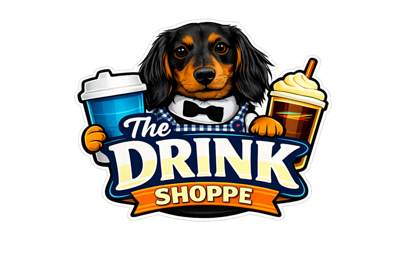

<p align="center">
  
</p>

<h1 align="center">The Drink Shoppe 🍹</h1>

https://jstiner.github.io/TheDrinkShoppe/


A fun **local drink generator** inspired by soda shops and energy drink stands.

The Drink Shoppe lets you experiment with flavor combinations, discover new drinks, and save your favorites.

The project runs entirely in the browser with **no backend required**, making it perfect for GitHub Pages.

---

# Features

### Drink Generator
Generate drinks based on:

- Base drink
- Up to **3 syrup flavors**
- Optional **Lotus energy**

### Recipe Library

The app includes:

- Recipes **inspired by popular soda shop drinks**
- Original **Drink Shoppe house recipes**
- A drink generator that creates fun new combinations

### Favorites

Save drinks you like so they appear quickly later.

### Hide Drinks

Hide combinations you don't want to see again.

### Saved Drinks

Create and name your own drinks.

### Offline Friendly

Everything runs locally in the browser.

No server required.

---

# Drink Bases

The generator currently supports:

- Bubble Water Fizz
- Lemonade
- Lotus Energy
- Cola
- Root Beer
- Dr-style soda

---

# Syrups

The flavor combinations are based on common soda shop syrup flavors such as:

- Torani
- Monin
- DaVinci

These syrups are widely used in soda stands and drink shops.

---

# Lotus Energy

Energy drinks in the generator use **Lotus Plant Power energy concentrate**.

https://lotusplantpower.com

Lotus is a popular plant-based energy base used by many soda stands.

---

# Recipe Collections

The recipe library includes several collections.

### Inspired by 7 Brew

These drinks are **inspired by commonly shared recipes attributed to 7 Brew** and similar soda shops.

Examples include:

- Sunrise
- Ocean Breeze
- Razorberry
- Tiger's Blood
- Pixie Stick

These recipes were compiled from public sources and fan discussions.

### Drink Shoppe House Recipes

Original drink ideas created for this project.

These combinations are meant to expand the menu with fun names and flavor experiments.

Examples:

- Voltage
- Ruby Storm
- Coconut Sunset
- Purple Haze

---

# Adding Recipes

Recipes are stored in:

```
recipes.json
```

Each entry looks like this:

```json
 {
      "id": "house-fizz-murphy",
      "name": "The Murphy",
      "source": "Drink Shoppe",
      "collection": "House Signature",
      "baseId": "fizz",
      "lotusRequired": false,
      "syrups": [
        { "id": "blackberry", "pumps": 2 },
        { "id": "vanilla", "pumps": 2 },
        { "id": "brown_sugar_cinnamon", "pumps": 0.5 }
      ]
    }
```

Fields:

| Field | Description |
|------|-------------|
| id | unique identifier |
| name | drink name |
| source | where the recipe idea came from |
| collection | recipe group |
| baseId | drink base |
| lotusRequired | if Lotus energy is required |
| syrupIds | syrups used in the drink |

---

# Project Goals

This project exists to:

- Experiment with drink combinations
- Create fun custom soda shop menus
- Practice building lightweight web apps
- Share drink ideas with family and friends

---

# Disclaimer

This project is a **personal hobby project** and is not affiliated with, endorsed by, or associated with any beverage brands or establishments referenced in the drink recipes.

Some drink names and recipe combinations are inspired by or commonly attributed to popular soda shops such as **7 Brew**. These recipes were compiled from publicly available sources, fan communities, and experimentation and may not reflect official recipes used by those establishments.

All trademarks, brand names, and drink names remain the property of their respective owners.

---

# License

MIT License

Feel free to fork the project and build your own drink generator.
